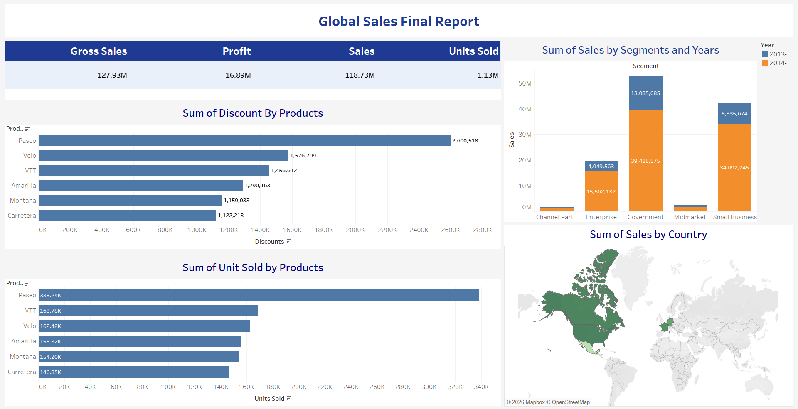
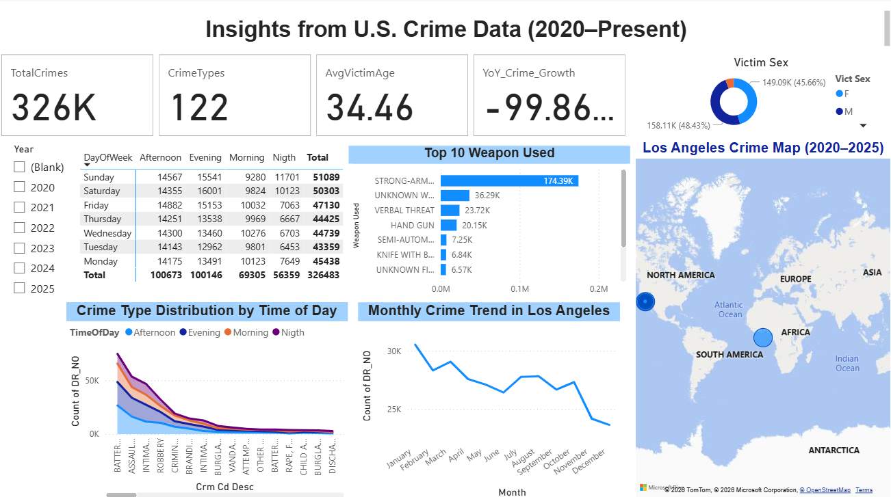

# Data-Visualization-Projects
A portfolio of data visualization projects built with Power BI and Tableau.
## Tools
- Microsoft Power BI
- Tableau
- Excel
- DAX
- Power Query

## Projects

### Sales Dashboard

Analyzes sales performance, revenue trends, and key business metrics.

### Crime Dashboard

Visualizes crime statistics and geographic patterns using interactive charts.

## Files
- Power BI report (.pbix)
- Tableau workbook (.twb)
- Project documentation (.pdf, .docx)
